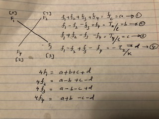

## Project: 3D Controls
### Saminda Abeyruwan

### Specification

* Provide a Writeup / README that includes all the rubric points and how you addressed each one. 
You can submit your writeup as markdown or pdf.

* Implemented body rate control in C++.

__Completed__

* Implement roll pitch control in C++.

__Completed__

* Implement altitude controller in C++.

__Completed__

* Implement lateral position control in C++.

__Completed__

* Implement yaw control in C++.

__Completed__

* Implement calculating the motor commands given commanded thrust and moments in C++.

__Completed__



F_1 to F_4 has been calculated as shown in the figure. When commanding
forces _desiredThrustsN[2]_, and _desiredThrustsN[3]_ are assigned 
with F_4 and F_3.  

### The Tasks

All the tasks are implemented studying the material covered in the lectures
and Python controller. 

* Scenario 1

```$xslt
PASS: ABS(Quad.PosFollowErr) was less than 0.500000 for at least 0.800000 seconds
```

* Scenario 2

```$xslt
PASS: ABS(Quad.Roll) was less than 0.025000 for at least 0.750000 seconds
PASS: ABS(Quad.Omega.X) was less than 2.500000 for at least 0.750000 seconds
```

* Scenario 3

```$xslt
PASS: ABS(Quad1.Pos.X) was less than 0.100000 for at least 1.250000 seconds
PASS: ABS(Quad2.Pos.X) was less than 0.100000 for at least 1.250000 seconds
PASS: ABS(Quad2.Yaw) was less than 0.100000 for at least 1.000000 seconds
```

* Scenario 4

```$xslt
PASS: ABS(Quad1.PosFollowErr) was less than 0.100000 for at least 1.500000 seconds
PASS: ABS(Quad2.PosFollowErr) was less than 0.100000 for at least 1.500000 seconds
PASS: ABS(Quad3.PosFollowErr) was less than 0.100000 for at least 1.500000 seconds
```

* Scenario 5

```$xslt
PASS: ABS(Quad2.PosFollowErr) was less than 0.250000 for at least 3.000000 seconds
```